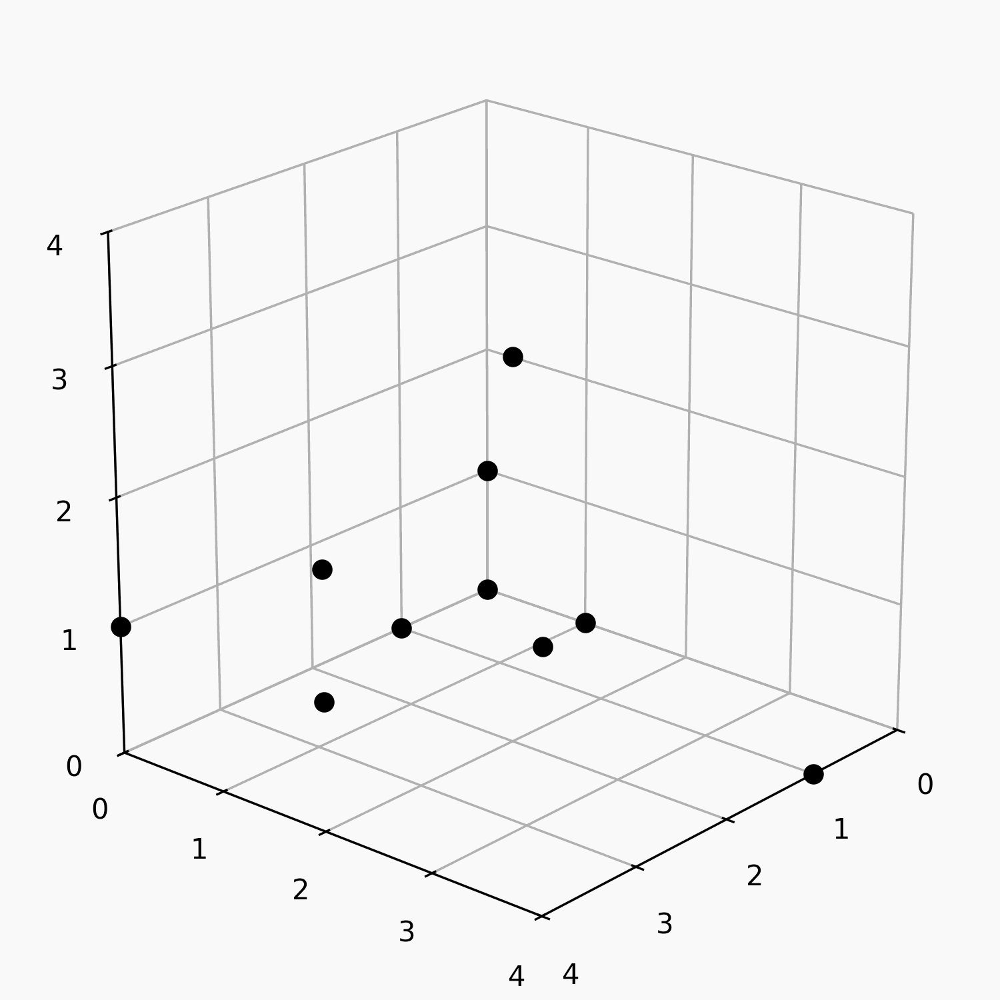

# z3_points
<p align="center">
  
</p>
Confusingly titled mixed integer linear programming model designed to find optimally equidistributed subsets.<br><br>
This project started at the recurse center in fall 2025 when someone told me about z3. I decided I would try to use it to find interesting subsets, as ML net-based project with which I was trying to attack the problem (you can find it on this github) was plateauing before become quite interesting enough. The confused and garbled remnants of that attempt can be found in the "solve.py" file.<br><br>
Eventually, figured out how to make all conditions linear by introducing a few more variables. Since the optimization was now completely linear with 0-1 variables, I switched to OR- tools.<br><br>
The image above is a collection of optimally equidistrubted subsets of the three dimensional vector space over the integers mod five. (There is a break a symmetry where I require them to all contain (0, 0, 0), (1, 0, 0), (0, 1, 0), (0, 0, 1)). They are all equidistributed on ten families of parallel planes. After imposing a couple geometric conditions described below, these are optimal, in the sense that there are no subsets satisfying the conditions that are equidistubuted in eleven directions.
## Geometric requirements
Let $S$ be the subset and $p$ be the prime paramaterizing the space. To be a valid solution to the optimization, the following must be true:
1: $|S| = mp$ where $2 \leq m \leq p - 1$
2: For every line $\ell$, $|S \cap \ell| \leq \min (m, p - m)$
3: For every plane $P$, $|S \cap P| \leq p$
## Instructions
The model is found in the "linear.py" file. To run the milp_model function, you'll need to install OR-tools:
```bash
pip install ortools
```
The function takes four arguments:
prime: the prime parametrizing the space
m: the multiple of the prime that gives the size of the subset you're interested in. So if prime=5 and you're interested in subsets of size 15, m=3.
threshold: the number of parallel planes on which you require the plane to be equidistributed. So when threshold=6, the function will either return a set which is equidistrubted on at least 6 families of parallel planes, or None.
seed: the seed for the optimizer
<br>
Note that for most cases, the optimizer will not converge... the search space gets very big very fast.
<br>
Running the below will gives a proof that the animated examples above are optimial.
```python
milp_model(5, 2, 10)
milp_model(5, 2, 11)
milp_model(5, 3, 3)
milp_model(5, 4, 1)
```
Note that milp_model(5, 3, 3) will take a while to finish. On my laptop, it takes about ten minutes.
